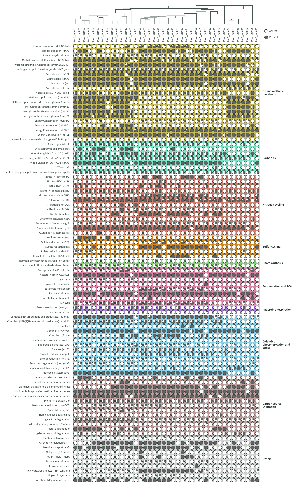

# GenoCap

GenoCap is a browser-based tool for exploring genome capabilities from KEGG annotations across genome collections. Files are processed locally and are never uploaded.

## Live application

[![Button Click]][link]


## Features

- Visualize KEGG annotations across multiple genomes in Module, Gene, or Key gene mode.
- Display binary presence or quartile module completeness using circles or squares.
- Filter metabolism groups, customize colors and layout, and cluster genomes.
- Export the complete visualization as SVG or PNG and the displayed matrix as CSV.

## Technology stack

- **Application framework:** [Next.js 16](https://nextjs.org/) with the App Router and static export.
- **User interface:** [React 19](https://reactjs.org/), TypeScript, [Ant Design 6](https://ant.design/), and [Tailwind CSS 4](https://tailwindcss.com/).
- **Visualization:** Interactive, dynamically generated SVG rendered directly by [React](https://reactjs.org/).
- **Data processing:** [Papa Parse](https://www.papaparse.com/) for TSV/CSV input, with parsing, matrix construction, clustering, and exports performed entirely in the browser.
- **Testing and quality:** Vitest, ESLint, and the Next.js TypeScript production build.
- **Deployment:** GitHub Actions and [GitHub Pages](https://pages.github.com/) on Node.js 22.

## Run locally

Requirements: Node.js 22.13 or newer.

```powershell
cd web
npm install
npm run dev
```

Open `http://localhost:3000` in a browser.

## Database

The database JSON is regenerated automatically from [db/GenoCap_db.tsv](db/GenoCap_db.tsv) whenever the development server or production build starts. Users are encouraged to edit the TSV file directly to add or remove KEGG modules, genes, or KOs.

## GitHub Pages deployment

The application is exported as a fully static site. Every push to `main` runs the checks, builds `web/out`, and deploys it through GitHub Pages.

## Input

Select TSV or CSV in the interface, then upload a file containing the exact headers `gene`, `genome`, and `ko`. A KO cell may contain multiple identifiers separated by semicolons, commas, pipes, or a mixture of these. In CSV files, KO values containing commas must be quoted.

The supplied [doc/input_annotation.tsv](doc/input_annotation.tsv) file can be used as a complete example.

## Project structure

- `web/` — Next.js and Ant Design application.
- `db/GenoCap_db.tsv` — authoritative functional reference database.
- `doc/` — example input and reference visualization.
- `.github/workflows/deploy-pages.yml` — automated GitHub Pages deployment.

## Quality checks

```powershell
cd web
npm test
npm run lint
npm run build
```

## Example visualization

Here is an example visualization generated from the provided `doc/input_annotation.tsv` file:




## Citation

GenoCap has not been formally published yet. If you use GenoCap in your research, please cite it as:

```
Lin, H. (2026). GenoCap (Version 0.5) [Web application]. Available at https://github.com/SilentGene/GenoCap
```

...🧙‍♂️🧬

[link]: https://silentgene.github.io/GenoCap/ 'Open GenoCap Online App'
[Button Click]: https://img.shields.io/badge/Open_GenoCap!-37a779?style=for-the-badge